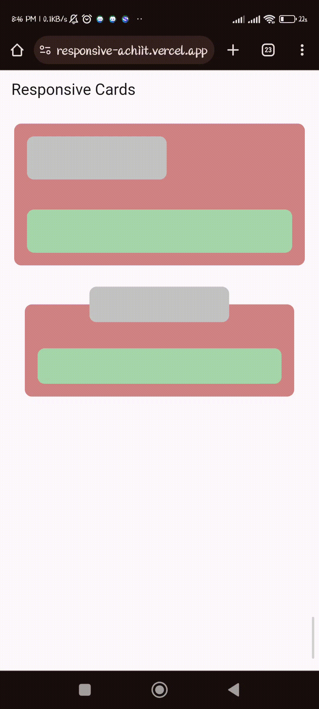

# Responsive Cards in Flutter

A Flutter application demonstrating how to create responsive cards with a custom design. The app features two different cards on the same screen, with unique responsive behavior.


## Task Overview

The goal of this project is to create two cards with the following responsive design requirements:

### Card 1 (Top Card)

- As the screen size grows or shrinks, the width of the card changes to occupy the same proportion of the screen.
- The green area inside the card also grows to take the same proportion of the screen as before.

### Card 2 (Bottom Card)

- As the screen size grows or shrinks, the width of the card changes to occupy the same proportion of the screen.
- The green area inside it also changes.
- The grey area in Card 2 remains the same size and stays at the top center of the card.

## Implementation

To achieve this responsive design, the project uses the MVVM (Model-View-ViewModel) architecture in Flutter. The code is organized as follows:

- **Model**: The data model is managed by the `CardViewModel` class, which holds the proportions and sizes for Card 1 and Card 2.

- **View**: There are two card views, `Card1` and `Card2`, each responsible for rendering their respective cards. These views use Flutter's `LayoutBuilder` to calculate and adjust card dimensions based on screen size and the values provided by the ViewModel.

- **ViewModel**: The `CardViewModel` class extends `ChangeNotifier` to handle state management. It provides methods to update card proportions, which trigger notifications to update the views.

## Getting Started

Follow these steps to run the project:

1. Clone the repository:

   ```shell
   git clone https://github.com/your-username/your-repo.git

2. Install the required dependencies:

   ```shell
   flutter pub get

3. Run the Flutter app:

   ```shell
   flutter run


**Live Demo**: [View Demo](https://responsive-achiit.vercel.app/)


|                                                          |                                                      |
|----------------------------------------------------------|:----------------------------------------------------:|
|      |  |  
